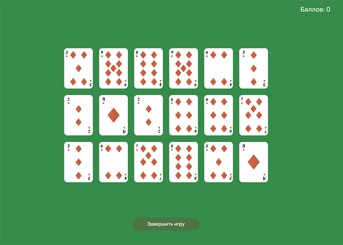

<h1 align="center">Игра "Memory"</h1>

    

<h2 align="left">Описание</h2>

**Memory** - это игра на тренировку памяти. 

**Правила игры:**

- На игровом столе раскладывается карты. С одной стороны они имеют изображение, с другой рубашку. 
- Каждая карта имеет пару, поэтому общее число карт чётное. 
- В начале игры все карты открыты, чтобы можно было запомнить их расположение. Далее они переворачиваются рубашкой вверх.
- Игрок открывает любые 2 карты за один ход.
- Если открыты одинаковые карты, то они пропадают со стола, а игроку начисляются баллы.
- Если открыты разные карты, то они переворачиваются обратно рубашкой вверх, а количество баллов уменьшается.

<h2 align="left">Логика игры</h2>

Внешний вид игры стилизован с помощью HTML и CSS.

Функционал реализован на JavaScript:

- Игра стартует при нажатии на кнопку "Начать игру".
- Игрок имеет счетчик набранных баллов, который изначально равен нулю и не может быть отрицательным.
- При старте игры на столе в случайном порядке раскладываются 9 пар одинаковых карт. После раскладки карты лежат открытыми в течение 5 секунд, а потом переворачиваются рубашкой вверх.
- Игрок нажимает на любую из карт. Она переворачивается и остаётся открытой. Открытую карту нельзя перевернуть обратно.
- Если вторая выбранная карта совпадает с первой, то они исчезают со стола, а число баллов увеличивается на количество нераскрытых пар.
- Если не совпадает, то карты через 1 секунду переворачиваются обратно, а число баллов уменьшается на количество раскрытых пар.
- За один ход нельзя открыть более двух карт.
- Игрок может прервать игру в любой момент, нажав на кнопку "Завершить игру". Тогда откроется экран с количеством набранных баллов и кнопкой "Повторить игру", которая запускает игру заново.

<h2 align="left">Что можно добавить</h2>

В планах:

- Возможность изменить количество карт.
- Добавить таймер.
